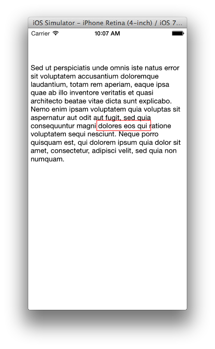

This is a basic textkit example that allows to tap in a certain area in textview and load a new viewcontroller.  Most help is from http://cocoafactory.com/blog/2012/10/29/how-to-use-custom-nsattributedstring-attributes/. Optimized for iOS 7.

